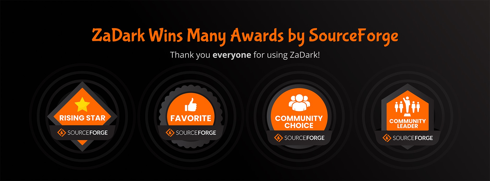

# ZaDark fork for ZaloAlt
## About

ZaDark is originally an extension that helps you enable Dark Mode for Zalo PC and Web. ZaDark is available on multiple platforms. This fork only aims to maintain compatibility with [ZaloAlt](https://github.com/imchocomint/ZaloAlt/)

https://zadark.com/

## License

ZaDark's source code is freely available for use, modification and distribution under the permissions, limitations and conditions listed in the [Mozilla Public License 2.0](./LICENSE).

## Contact

https://zadark.com/contact

